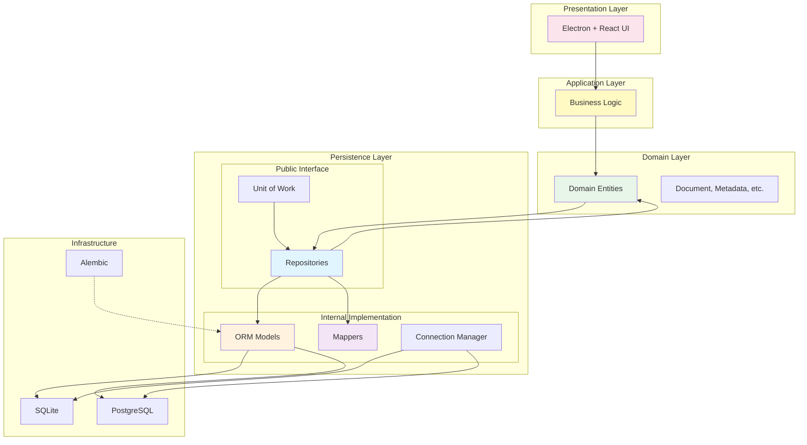
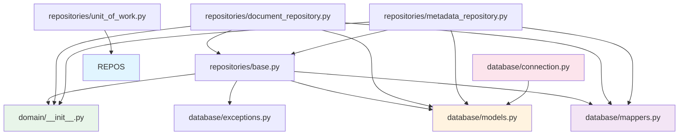
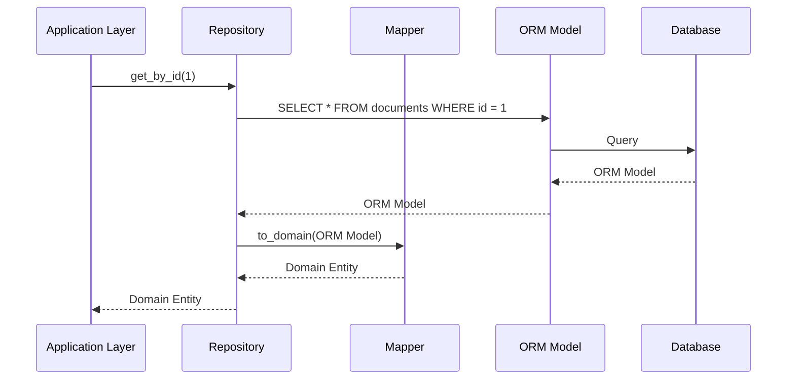
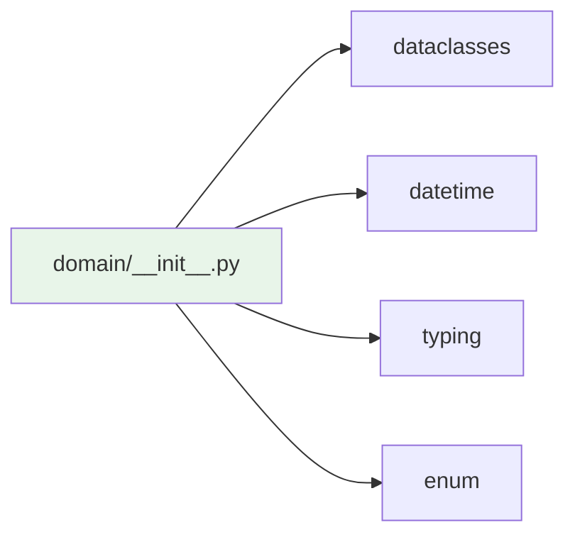
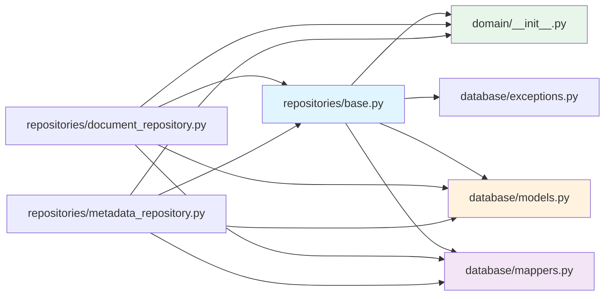
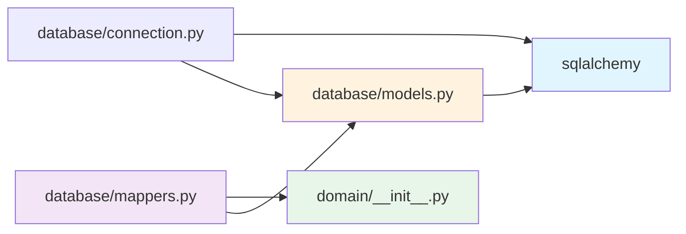
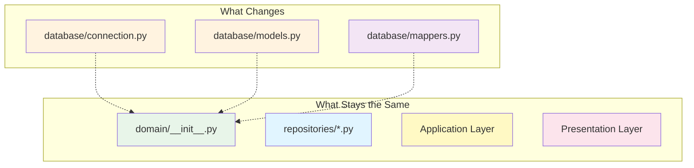

# Dependency Graph

## Clean Architecture Dependency Graph



## Module Dependency Graph



## Data Flow Diagram



## Architecture Layers Comparison

### Before Refactoring (Violations)

```
Application Layer
    ↓ (violates: depends on SQLAlchemy)
Persistence Layer
    ↓ (violates: ORM models exposed)
Domain Layer (empty/ignored)
```

### After Refactoring (Compliant)

```
Application Layer
    ↓ (depends on domain entities only)
Domain Layer
    ↓ (pure Python, no infrastructure)
Persistence Layer
    ↓ (ORM models internal, mappers convert)
Database
```

## Import Dependencies

### Domain Layer



### Repository Layer



### Persistence Layer



## Database Portability

### SQLite to PostgreSQL Migration


