# Updated Dependency Graph (With Repository Interfaces)

## Clean Architecture Dependency Graph (Updated)

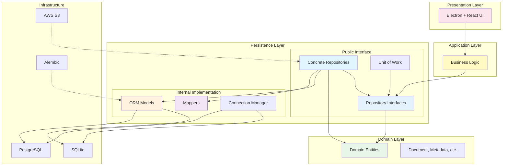

## Module Dependency Graph (Updated)

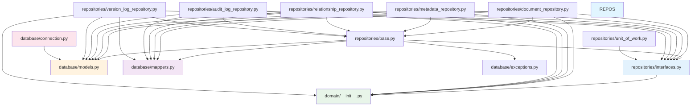

## Dependency Inversion Example

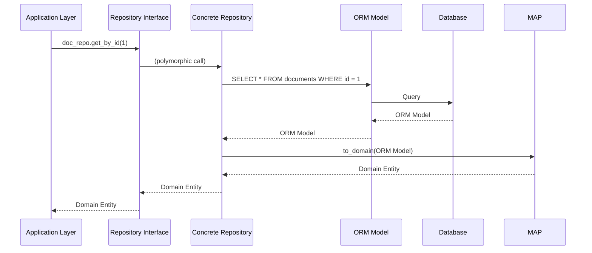

## Application Layer Dependency

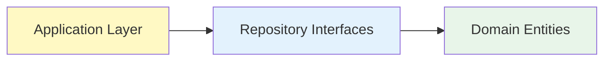

**Key Point:** Application layer depends ONLY on interfaces, not concrete implementations.

## Multiple Implementations

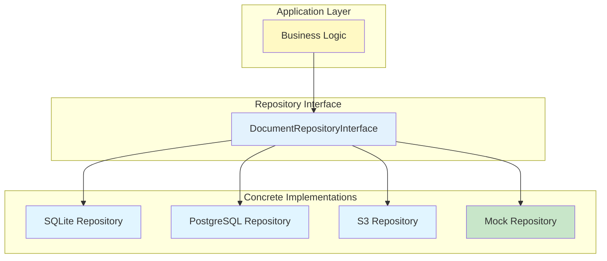

## Repository Package Exports

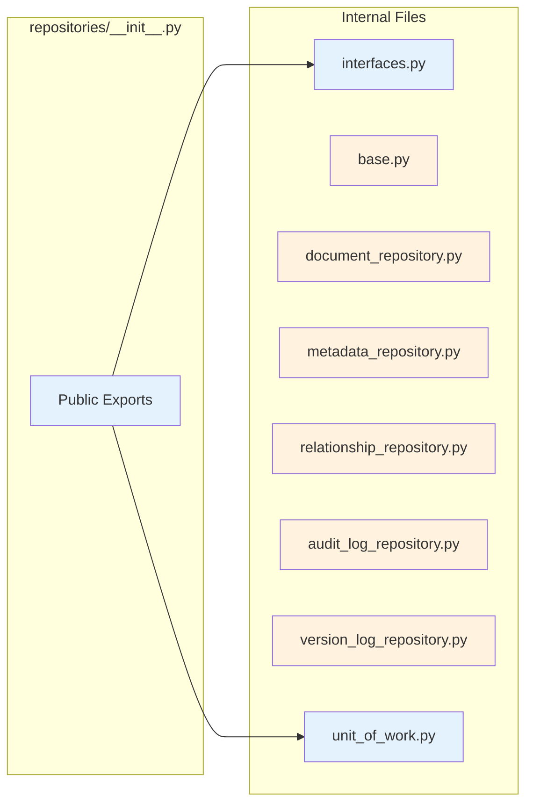

**Key Point:** Only interfaces and Unit of Work are exported. Concrete implementations are internal.

## Testing Architecture

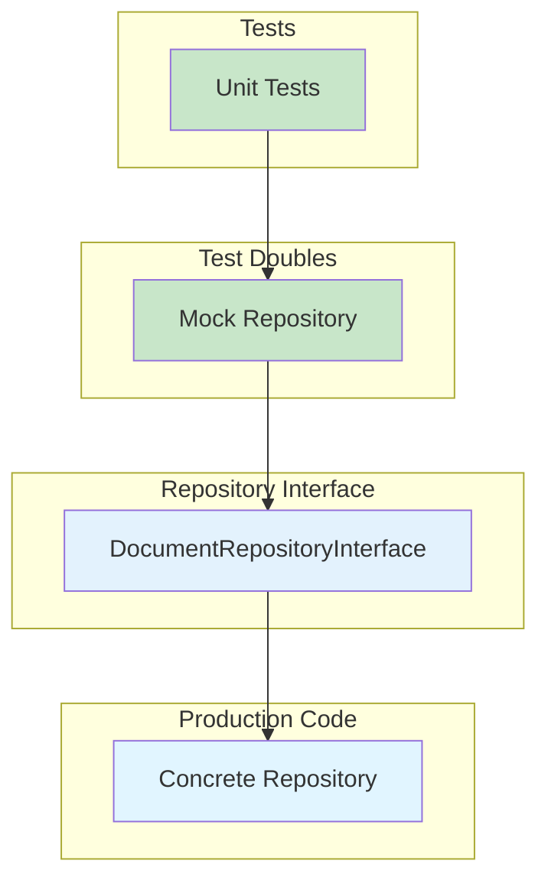

**Key Point:** Tests use mock implementations that implement the same interface as production code.

## Database Portability

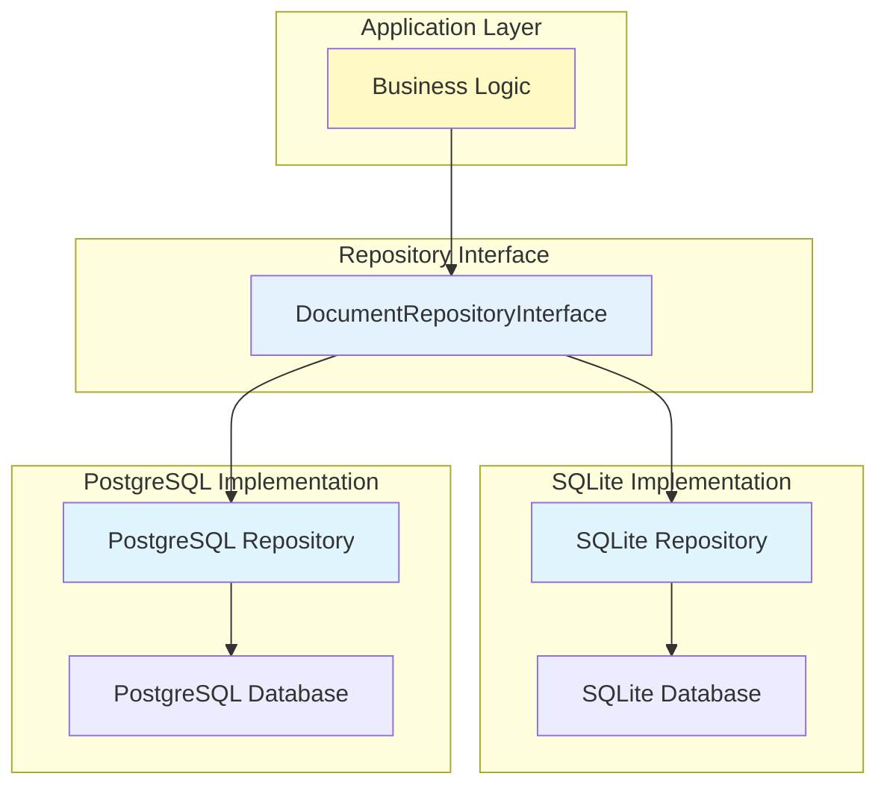

**Key Point:** Application layer unchanged when switching databases.

## Cloud Storage Support

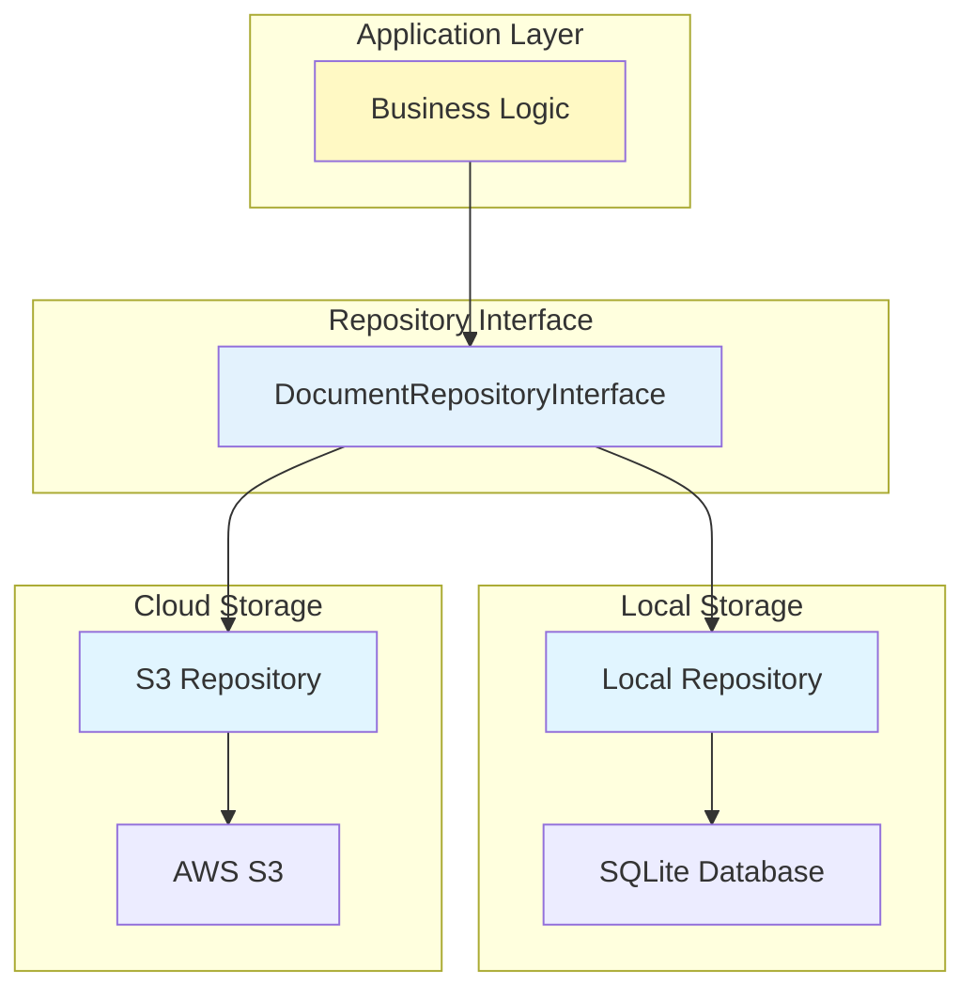

**Key Point:** Application layer unchanged when migrating to cloud storage.

## Comparison: Before vs After

### Before (No Interfaces)

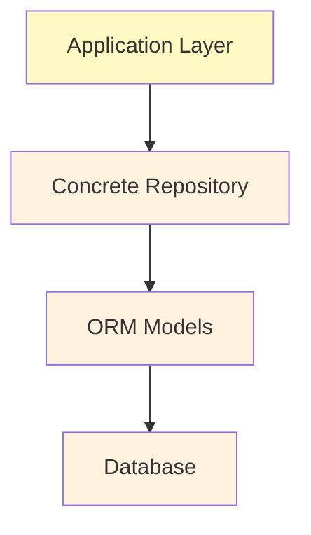

**Problem:** Application depends on concrete implementation.

### After (With Interfaces)

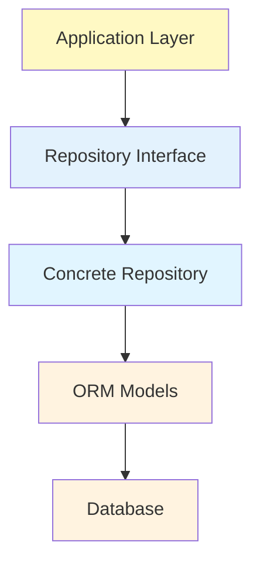

**Solution:** Application depends on interface, concrete implementation depends on interface.

## Summary of Changes

### Added

1. **Repository Interfaces** (`repositories/interfaces.py`)
   - DocumentRepositoryInterface
   - MetadataRepositoryInterface
   - RelationshipRepositoryInterface
   - AuditLogRepositoryInterface
   - VersionLogRepositoryInterface

2. **Concrete Implementations Updated**
   - All repositories now implement their respective interfaces
   - DocumentRepository implements DocumentRepositoryInterface
   - MetadataRepository implements MetadataRepositoryInterface
   - etc.

3. **Package Exports Updated**
   - Only interfaces and Unit of Work are exported
   - Concrete implementations are internal

### Benefits

1. **Dependency Inversion**
   - Application depends on interfaces
   - Concrete implementations depend on interfaces
   - High-level modules decoupled from low-level modules

2. **Testing**
   - Easy to mock for unit tests
   - Tests run without database
   - Faster, more reliable tests

3. **Database Portability**
   - Switch databases without application changes
   - Support multiple databases simultaneously
   - Gradual migration strategies

4. **Cloud Storage Support**
   - Migrate to cloud storage seamlessly
   - Support multiple cloud providers
   - Hybrid local + cloud deployments

---

**Document Version:** 2.0
**Last Updated:** 2024-01-01
**Changes:** Added repository interfaces for dependency inversion
