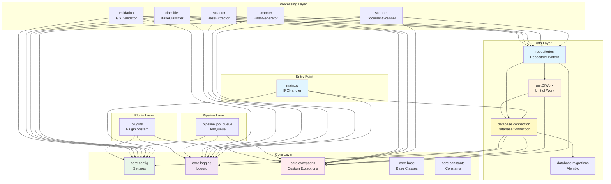

# Backend Architecture Diagram

```mermaid
graph TB
    subgraph "Entry Point"
        MAIN[main.py<br/>IPCHandler]
    end

    subgraph "Core Layer"
        CONFIG[core.config<br/>Settings]
        LOGGING[core.logging<br/>Loguru]
        EXCEPTIONS[core.exceptions<br/>Custom Exceptions]
        BASE[core.base<br/>Base Classes]
        CONSTANTS[core.constants<br/>Constants]
    end

    subgraph "Data Layer"
        CONN[database.connection<br/>DatabaseConnection]
        MIGRATIONS[database.migrations<br/>Alembic]
        REPOS[repositories<br/>Repository Pattern]
        UOW[unitOfWork<br/>Unit of Work]
    end

    subgraph "Processing Layer"
        SCANNER[scanner<br/>DocumentScanner]
        HASH[scanner<br/>HashGenerator]
        EXTRACTOR[extractor<br/>BaseExtractor]
        CLASSIFIER[classifier<br/>BaseClassifier]
        VALIDATOR[validation<br/>GSTValidator]
    end

    subgraph "Pipeline Layer"
        QUEUE[pipeline.job_queue<br/>JobQueue]
    end

    subgraph "Plugin Layer"
        PLUGINS[plugins<br/>Plugin System]
    end

    MAIN --> CONFIG
    MAIN --> LOGGING
    MAIN --> CONN

    SCANNER --> CONFIG
    SCANNER --> LOGGING
    SCANNER --> EXCEPTIONS
    SCANNER --> REPOS

    HASH --> CONFIG
    HASH --> LOGGING
    HASH --> REPOS

    EXTRACTOR --> CONFIG
    EXTRACTOR --> LOGGING
    EXTRACTOR --> EXCEPTIONS
    EXTRACTOR --> REPOS

    CLASSIFIER --> CONFIG
    CLASSIFIER --> LOGGING
    CLASSIFIER --> EXCEPTIONS
    CLASSIFIER --> REPOS

    VALIDATOR --> CONFIG
    VALIDATOR --> LOGGING
    VALIDATOR --> EXCEPTIONS
    VALIDATOR --> REPOS

    QUEUE --> CONFIG
    QUEUE --> LOGGING
    QUEUE --> EXCEPTIONS

    REPOS --> CONN
    REPOS --> UOW
    REPOS --> EXCEPTIONS

    UOW --> CONN
    UOW --> EXCEPTIONS

    CONN --> CONFIG
    CONN --> LOGGING
    CONN --> EXCEPTIONS
    CONN --> MIGRATIONS

    PLUGINS --> CONFIG
    PLUGINS --> LOGGING
    PLUGINS --> EXCEPTIONS

    style MAIN fill:#e1f5ff
    style CONFIG fill:#e8f5e9
    style LOGGING fill:#f3e5f5
    style EXCEPTIONS fill:#ffebee
    style CONN fill:#fff9c4
    style REPOS fill:#e1f5ff
    style UOW fill:#fff3e0
```
