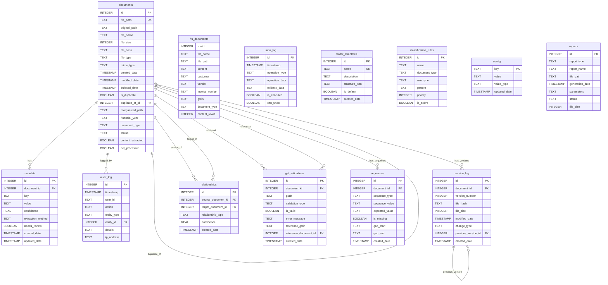

# Database Relationships Diagram

```mermaid
erDiagram
    documents {
        INTEGER id PK
        TEXT file_path UK
        TEXT original_path
        TEXT file_name
        INTEGER file_size
        TEXT file_hash
        TEXT file_type
        TEXT mime_type
        TIMESTAMP created_date
        TIMESTAMP modified_date
        TIMESTAMP indexed_date
        BOOLEAN is_duplicate
        INTEGER duplicate_of_id FK
        TEXT reorganized_path
        TEXT financial_year
        TEXT document_type
        TEXT status
        BOOLEAN content_extracted
        BOOLEAN ocr_processed
    }

    metadata {
        INTEGER id PK
        INTEGER document_id FK
        TEXT key
        TEXT value
        REAL confidence
        TEXT extraction_method
        BOOLEAN needs_review
        TIMESTAMP created_date
        TIMESTAMP updated_date
    }

    fts_documents {
        INTEGER rowid
        TEXT file_name
        TEXT file_path
        TEXT content
        TEXT customer
        TEXT vendor
        TEXT invoice_number
        TEXT gstin
        TEXT document_type
        INTEGER content_rowid
    }

    audit_log {
        INTEGER id PK
        TIMESTAMP timestamp
        TEXT user_id
        TEXT action
        TEXT entity_type
        INTEGER entity_id FK
        TEXT details
        TEXT ip_address
    }

    undo_log {
        INTEGER id PK
        TIMESTAMP timestamp
        TEXT operation_type
        TEXT operation_data
        TEXT rollback_data
        BOOLEAN is_executed
        BOOLEAN can_undo
    }

    folder_templates {
        INTEGER id PK
        TEXT name UK
        TEXT description
        TEXT structure_json
        BOOLEAN is_default
        TIMESTAMP created_date
    }

    classification_rules {
        INTEGER id PK
        TEXT name
        TEXT document_type
        TEXT rule_type
        TEXT pattern
        INTEGER priority
        BOOLEAN is_active
    }

    config {
        TEXT key PK
        TEXT value
        TEXT value_type
        TIMESTAMP updated_date
    }

    version_log {
        INTEGER id PK
        INTEGER document_id FK
        INTEGER version_number
        TEXT file_hash
        INTEGER file_size
        TIMESTAMP modified_date
        TEXT change_type
        INTEGER previous_version_id FK
        TIMESTAMP created_date
    }

    relationships {
        INTEGER id PK
        INTEGER source_document_id FK
        INTEGER target_document_id FK
        TEXT relationship_type
        REAL confidence
        TIMESTAMP created_date
    }

    gst_validations {
        INTEGER id PK
        INTEGER document_id FK
        TEXT gstin
        TEXT validation_type
        BOOLEAN is_valid
        TEXT error_message
        TEXT reference_gstin
        INTEGER reference_document_id FK
        TIMESTAMP created_date
    }

    sequences {
        INTEGER id PK
        INTEGER document_id FK
        TEXT sequence_type
        TEXT sequence_value
        TEXT expected_value
        BOOLEAN is_missing
        TEXT gap_start
        TEXT gap_end
        TIMESTAMP created_date
    }

    reports {
        INTEGER id PK
        TEXT report_type
        TEXT report_name
        TEXT file_path
        TIMESTAMP generation_date
        TEXT parameters
        TEXT status
        INTEGER file_size
    }

    documents ||--o{ metadata : "has"
    documents ||--o{ documents : "duplicate_of"
    documents ||--o{ audit_log : "logged_by"
    documents ||--o{ version_log : "has_versions"
    documents ||--o{ relationships : "source_of"
    documents ||--o{ relationships : "target_of"
    documents ||--o{ gst_validations : "validated"
    documents ||--o{ sequences : "has_sequence"
    version_log ||--o{ version_log : "previous_version"
    documents ||--o{ gst_validations : "references"
```
