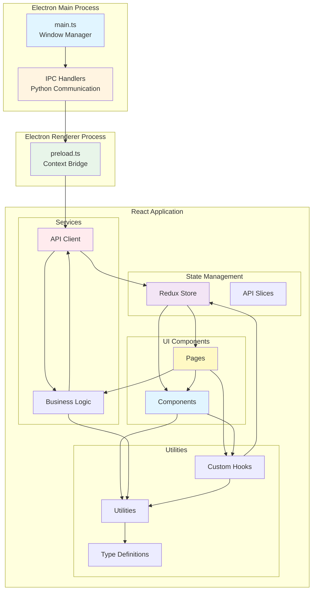

# Frontend Architecture Diagram

```mermaid
graph TB
    subgraph "Electron Main Process"
        MAIN[main.ts<br/>Window Manager]
        IPC_HANDLERS[IPC Handlers<br/>Python Communication]
    end

    subgraph "Electron Renderer Process"
        PRELOAD[preload.ts<br/>Context Bridge]
    end

    subgraph "React Application"
        subgraph "State Management"
            STORE[Redux Store]
            SLICES[API Slices]
        end

        subgraph "UI Components"
            PAGES[Pages]
            COMPONENTS[Components]
        end

        subgraph "Services"
            API[API Client]
            SERVICES[Business Logic]
        end

        subgraph "Utilities"
            HOOKS[Custom Hooks]
            UTILS[Utilities]
            TYPES[Type Definitions]
        end
    end

    MAIN --> IPC_HANDLERS
    IPC_HANDLERS --> PRELOAD
    PRELOAD --> API

    API --> STORE
    API --> SERVICES

    STORE --> PAGES
    STORE --> COMPONENTS

    PAGES --> COMPONENTS
    PAGES --> HOOKS
    PAGES --> SERVICES

    COMPONENTS --> HOOKS
    COMPONENTS --> UTILS

    SERVICES --> API
    SERVICES --> UTILS

    HOOKS --> STORE
    HOOKS --> UTILS

    UTILS --> TYPES

    style MAIN fill:#e1f5ff
    style IPC_HANDLERS fill:#fff4e1
    style PRELOAD fill:#e8f5e9
    style STORE fill:#f3e5f5
    style API fill:#ffebee
    style PAGES fill:#fff9c4
    style COMPONENTS fill:#e1f5ff
```
