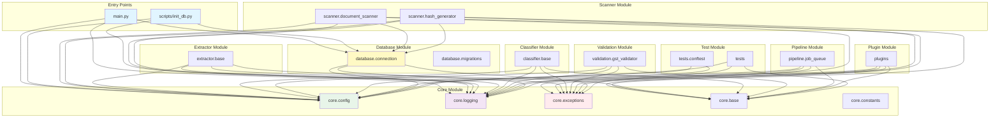

# Module Dependencies Diagram

```mermaid
graph TD
    subgraph "Entry Points"
        MAIN[main.py]
        INIT_DB[scripts/init_db.py]
    end

    subgraph "Core Module"
        CONFIG[core.config]
        LOGGING[core.logging]
        EXCEPTIONS[core.exceptions]
        BASE[core.base]
        CONSTANTS[core.constants]
    end

    subgraph "Database Module"
        CONN[database.connection]
        MIGRATIONS[database.migrations]
    end

    subgraph "Scanner Module"
        SCANNER[scanner.document_scanner]
        HASH[scanner.hash_generator]
    end

    subgraph "Extractor Module"
        EXTRACTOR[extractor.base]
    end

    subgraph "Classifier Module"
        CLASSIFIER[classifier.base]
    end

    subgraph "Validation Module"
        VALIDATOR[validation.gst_validator]
    end

    subgraph "Pipeline Module"
        QUEUE[pipeline.job_queue]
    end

    subgraph "Plugin Module"
        PLUGINS[plugins]
    end

    subgraph "Test Module"
        TESTS[tests]
        CONFTEST[tests.conftest]
    end

    MAIN --> CONFIG
    MAIN --> LOGGING
    MAIN --> CONN

    INIT_DB --> CONFIG
    INIT_DB --> LOGGING
    INIT_DB --> CONN

    SCANNER --> CONFIG
    SCANNER --> LOGGING
    SCANNER --> EXCEPTIONS
    SCANNER --> BASE
    SCANNER --> CONN

    HASH --> CONFIG
    HASH --> LOGGING
    HASH --> EXCEPTIONS
    HASH --> BASE
    HASH --> CONN

    EXTRACTOR --> CONFIG
    EXTRACTOR --> LOGGING
    EXTRACTOR --> EXCEPTIONS
    EXTRACTOR --> BASE

    CLASSIFIER --> CONFIG
    CLASSIFIER --> LOGGING
    CLASSIFIER --> EXCEPTIONS
    CLASSIFIER --> BASE

    VALIDATOR --> CONFIG
    VALIDATOR --> LOGGING
    VALIDATOR --> EXCEPTIONS
    VALIDATOR --> BASE

    QUEUE --> CONFIG
    QUEUE --> LOGGING
    QUEUE --> EXCEPTIONS
    QUEUE --> BASE

    PLUGINS --> CONFIG
    PLUGINS --> LOGGING
    PLUGINS --> EXCEPTIONS
    PLUGINS --> BASE

    CONN --> CONFIG
    CONN --> LOGGING
    CONN --> EXCEPTIONS

    TESTS --> CONFIG
    TESTS --> EXCEPTIONS
    TESTS --> BASE

    CONFTEST --> CONFIG
    CONFTEST --> LOGGING

    style MAIN fill:#e1f5ff
    style INIT_DB fill:#e1f5ff
    style CONFIG fill:#e8f5e9
    style LOGGING fill:#f3e5f5
    style EXCEPTIONS fill:#ffebee
    style CONN fill:#fff9c4
```
