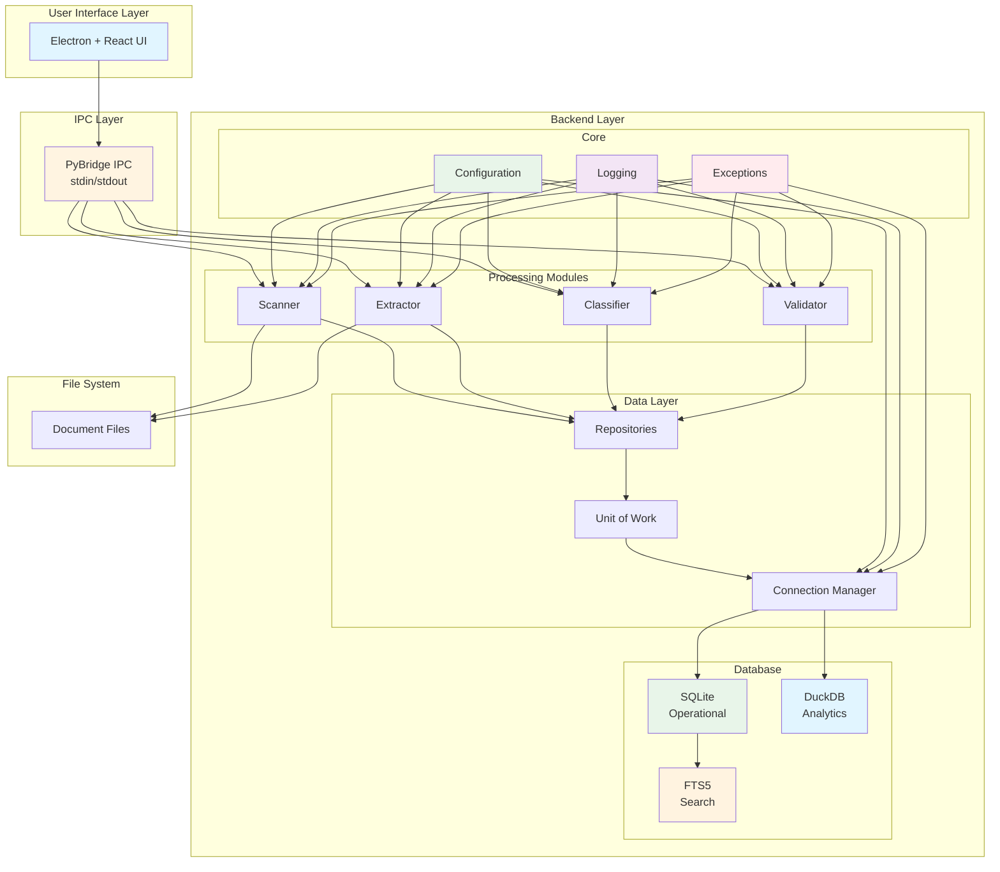

# System Architecture Diagram

```mermaid
graph TB
    subgraph "User Interface Layer"
        UI[Electron + React UI]
    end

    subgraph "IPC Layer"
        IPC[PyBridge IPC<br/>stdin/stdout]
    end

    subgraph "Backend Layer"
        subgraph "Core"
            CONFIG[Configuration]
            LOGGING[Logging]
            EXCEPTIONS[Exceptions]
        end

        subgraph "Processing Modules"
            SCANNER[Scanner]
            EXTRACTOR[Extractor]
            CLASSIFIER[Classifier]
            VALIDATOR[Validator]
        end

        subgraph "Data Layer"
            REPOS[Repositories]
            UOW[Unit of Work]
            CONN[Connection Manager]
        end

        subgraph "Database"
            SQLITE[SQLite<br/>Operational]
            FTS5[FTS5<br/>Search]
            DUCKDB[DuckDB<br/>Analytics]
        end
    end

    subgraph "File System"
        FILES[Document Files]
    end

    UI --> IPC
    IPC --> SCANNER
    IPC --> EXTRACTOR
    IPC --> CLASSIFIER
    IPC --> VALIDATOR

    SCANNER --> FILES
    EXTRACTOR --> FILES

    SCANNER --> REPOS
    EXTRACTOR --> REPOS
    CLASSIFIER --> REPOS
    VALIDATOR --> REPOS

    REPOS --> UOW
    UOW --> CONN
    CONN --> SQLITE
    CONN --> DUCKDB

    SQLITE --> FTS5

    CONFIG --> SCANNER
    CONFIG --> EXTRACTOR
    CONFIG --> CLASSIFIER
    CONFIG --> VALIDATOR
    CONFIG --> CONN

    LOGGING --> SCANNER
    LOGGING --> EXTRACTOR
    LOGGING --> CLASSIFIER
    LOGGING --> VALIDATOR
    LOGGING --> CONN

    EXCEPTIONS --> SCANNER
    EXCEPTIONS --> EXTRACTOR
    EXCEPTIONS --> CLASSIFIER
    EXCEPTIONS --> VALIDATOR
    EXCEPTIONS --> CONN

    style UI fill:#e1f5ff
    style IPC fill:#fff4e1
    style CONFIG fill:#e8f5e9
    style LOGGING fill:#f3e5f5
    style EXCEPTIONS fill:#ffebee
    style SQLITE fill:#e8f5e9
    style DUCKDB fill:#e1f5ff
    style FTS5 fill:#fff3e0
```
